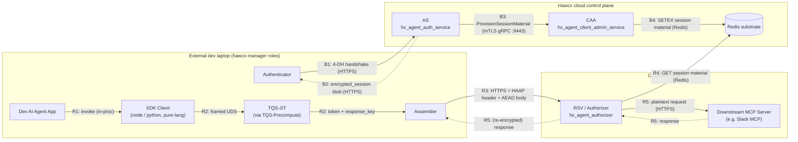

# HAAP Architecture Flow

HAAP runtime splits into two phases. **Bootstrap** (§4.2.1) runs once per agent: the
Authenticator role of `hawcx-manager` does an X3DH-style 4-DH handshake with the Auth
Server (AS), AS provisions session material to the Client Admin Authenticator (CAA)
over mTLS gRPC, and CAA persists it to Redis. **Runtime** is per-request: the SDK
client speaks framed UDS to a local TQS-JIT, gets a token plus a `response_key`, the
Assembler encrypts the body and ships the request to the Resource Service Verifier
(RSV), which reads Redis to recover `verifier_secret`, runs the cascade, and forwards
plaintext to the downstream MCP server. The Authenticator, TQS-JIT, and Assembler are
all roles of the same `hawcx-manager` multi-call binary on the dev's laptop.

## Diagram 1 — Block view



## Diagram 2 — Sequence view

```mermaid
sequenceDiagram
  autonumber
  participant DevApp as Dev App
  participant SDK as SDK Client
  participant AU as Authenticator
  participant TQ as TQS-JIT
  participant AS as Assembler
  participant ASRV as AS
  participant CAA as CAA
  participant R as Redis
  participant RSV as RSV
  participant MCP as MCP Server

  rect rgb(235,245,255)
  Note over AU,R: Phase 1 - Bootstrap (one-time per agent, §4.2.1)
  AU->>ASRV: B1 - 4-DH handshake (HTTPS, X3DH-style)
  Note right of ASRV: Derive K_session (HKDF root)<br/>and fresh verifier_secret
  ASRV-->>AU: B2 - encrypted_session blob (sealed under K_session)
  ASRV->>CAA: B3 - ProvisionSessionMaterial (mTLS gRPC :9443)
  Note right of CAA: Payload: session_id, verifier_secret,<br/>k_session_root, pk_c, agent_id,<br/>audience, scope_ceiling, policy_epoch
  CAA->>R: B4 - SETEX hawcx:caa:session_material:{org_id}:{session_id}<br/>(JSON, TTL = session_ttl + 30s)
  end

  rect rgb(240,255,240)
  Note over DevApp,MCP: Phase 2 - Runtime (per request)
  DevApp->>SDK: R1 - call tool / send request
  SDK->>TQ: R2 - framed UDS (local)
  Note right of TQ: verifier_secret flowed<br/>Authenticator -> Precompute -> JIT;<br/>Assembler never sees it
  TQ-->>AS: R2 - HAAP token + response_key (AES-256-GCM, 32B)
  AS->>RSV: R3 - HTTPS POST<br/>Authorization: HAAP <b64url(token)><br/>Body = AES-256-GCM(payload)
  Note right of AS: key = HKDF(response_key,<br/>info="hawcx-req-enc-v3" || session_id)<br/>AAD = session_id || jti || request_id || "request"
  RSV->>RSV: R4 - parse token, extract session_id from token body
  RSV->>R: R4 - GET session material by session_id
  R-->>RSV: R4 - verifier_secret + session fields
  Note right of RSV: Cascade (haap-core):<br/>MAC verify with verifier_secret,<br/>decrypt body, TBAC<->OAuth scope gate (§45.7.2)
  RSV->>MCP: R5 - plaintext request (HAAP headers stripped)
  MCP-->>RSV: R5 - response
  RSV-->>AS: R5 - (optionally re-encrypted) response
  AS-->>SDK: R5 - response
  SDK-->>DevApp: R5 - result
  end
```

## Current gaps (in flight)

- **Redis key schema mismatch.** CAA writes JSON via `SETEX` at
  `hawcx:caa:session_material:{org_id}:{session_id}`, but RSV currently reads a
  Redis **hash** at `hawcx:session:{session_id}`. The seam is broken end-to-end
  until both sides agree on key shape + encoding; fix in flight.
- **Empty `verifier_secret` on AS to CAA relay.** The
  `ProvisionSessionMaterial` payload AS ships today carries an empty
  `verifier_secret`, so even once the key schema is unified, the cascade MAC
  verification at RSV would still fail. Fix in flight on the AS side.
